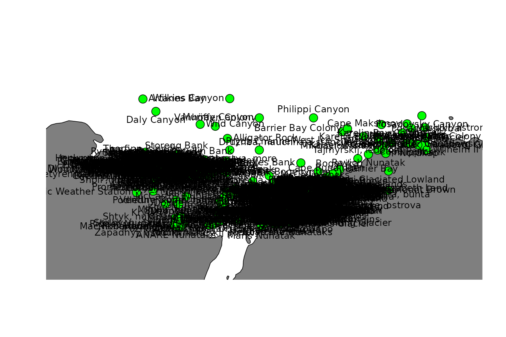
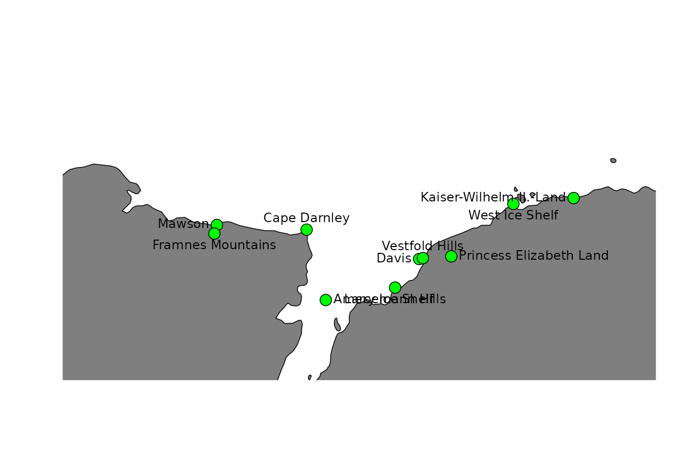
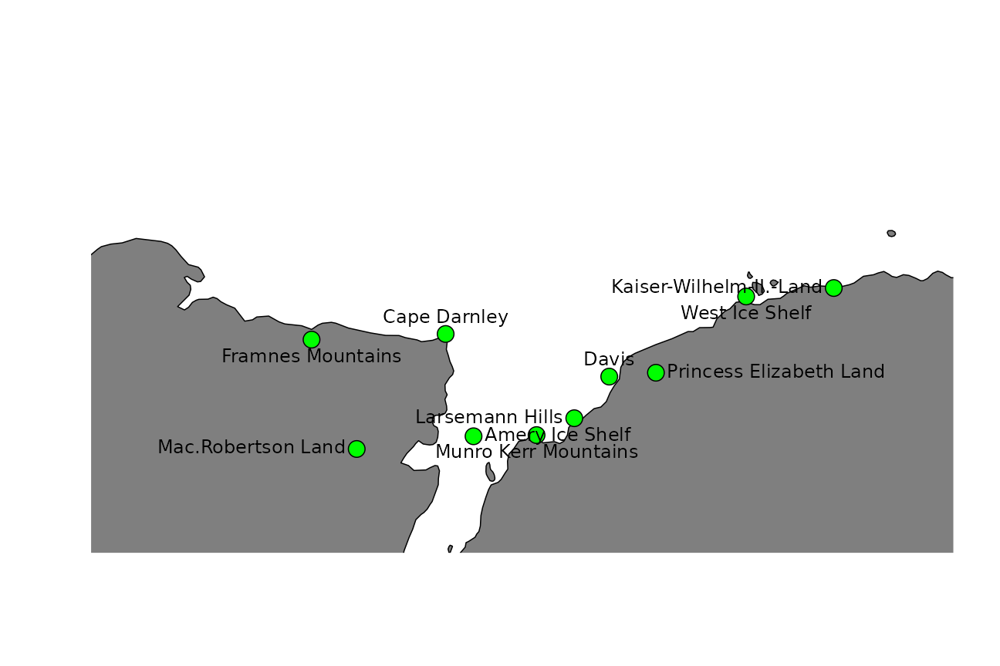
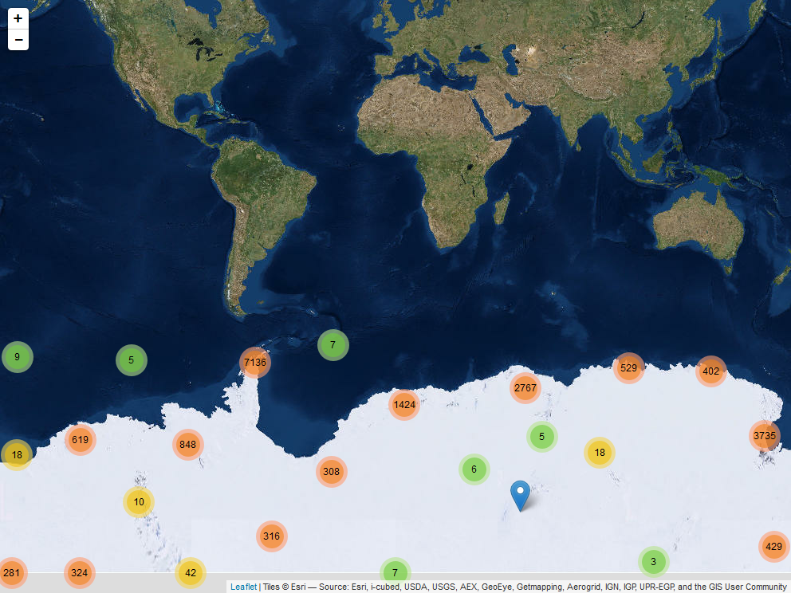
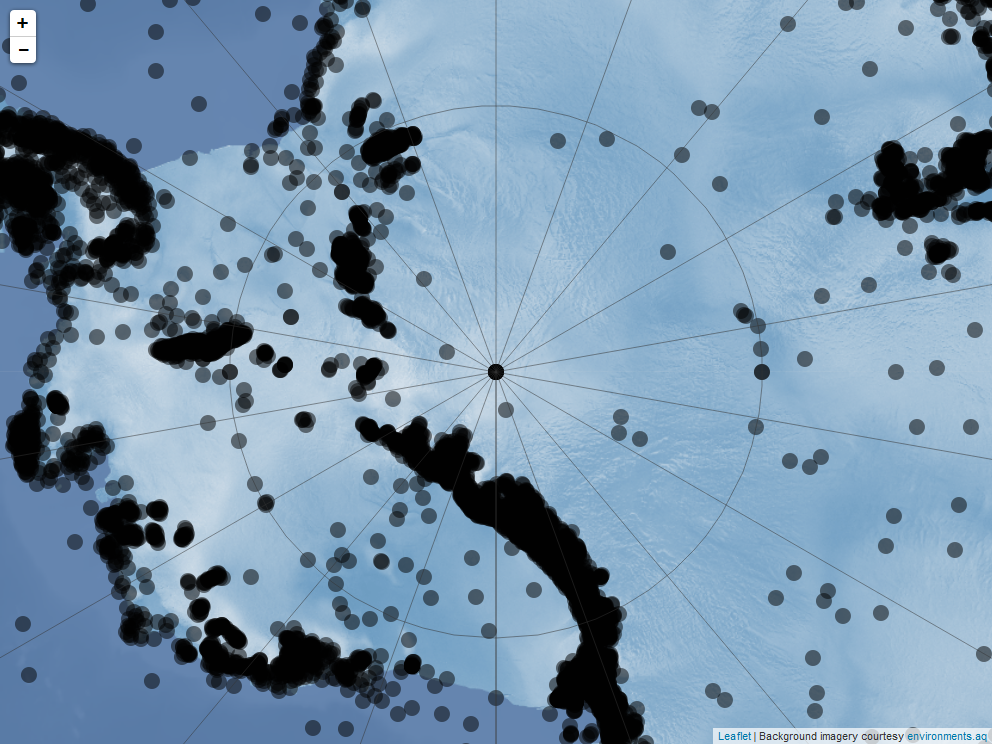

# antanym

## Overview

This R package provides easy access to Antarctic geographic place name
information, and tools for working with those names.

The authoritative source of place names in Antarctica is the Composite
Gazetteer of Antarctica (CGA), which is produced by the Scientific
Committee on Antarctic Research (SCAR). The CGA consists of
approximately 37,000 names corresponding to 19,000 distinct features. It
covers features south of 60 °S, including terrestrial and undersea or
under-ice features.

There is no single naming authority responsible for place names in
Antarctica because it does not fall under the sovereignty of any one
nation. In general, individual countries have administrative bodies that
are responsible for their national policy on, and authorisation and use
of, Antarctic names. The CGA is a compilation of place names that have
been submitted by representatives of national names committees from 22
countries.

The composite nature of the CGA means that there may be multiple names
associated with a given feature. Consider using the
[`an_preferred()`](https://docs.ropensci.org/antanym/reference/an_preferred.md)
function for resolving a single name per feature.

For more information, see the [CGA home
page](http://data.aad.gov.au/aadc/gaz/scar/). The CGA was begun in 1992.
Since 2008, Italy and Australia have jointly managed the CGA, the former
taking care of the editing, the latter maintaining the database and
website. The SCAR [Standing Committee on Antarctic Geographic
Information (SCAGI)](http://www.scar.org/data-products/scagi)
coordinates the project. This R package is a product of the SCAR [Expert
Group on Antarctic Biodiversity
Informatics](http://www.scar.org/ssg/life-sciences/eg-abi) and SCAGI.

### Citing

The SCAR Composite Gazetteer of Antarctica is made available under a
CC-BY license. If you use it, please cite it:

> Composite Gazetteer of Antarctica, Scientific Committee on Antarctic
> Research. GCMD Metadata
> ([http://gcmd.nasa.gov/records/SCAR_Gazetteer.html](http://gcmd.nasa.gov/records/SCAR_Gazetteer.md))

## Installing

``` r

install.packages("remotes")
remotes::install_github("ropensci/antanym")
```

## Usage

Start by fetching the names data from the host server. Here we use a
temporary cache so that we can re-load it later in the session without
needing to re-download it:

``` r

library(antanym)
g <- an_read(cache = "session")
```

If you want to be able to work offline, you can cache the data to a
directory that will persist between R sessions. The location of this
directory is determined by
[`rappdirs::user_cache_dir()`](https://rappdirs.r-lib.org/reference/user_cache_dir.html)
(see `an_cache_directory("persistent")` if you want to know what it is):

``` r

g <- an_read(cache = "persistent")
```

If you prefer working with `sp` objects, then this will return a
`SpatialPointsDataFrame`:

``` r

gsp <- an_read(sp = TRUE, cache = "session")
```

### Data summary

How many names do we have in total?

``` r

nrow(g)
```

    ## [1] 39187

Corresponding to how many distinct features?

``` r

length(unique(g$scar_common_id))
```

    ## [1] 20159

We can get a list of the feature types in the data:

``` r

head(an_feature_types(g), 10)
```

    ##  [1] "Aiguilles"           "Anchorage"           "Archipelago"        
    ##  [4] "Arm"                 "AWS"                 "Bank"               
    ##  [7] "Basin"               "Bay"                 "Beach"              
    ## [10] "Bedrock break point"

### Data structure

A description of the data structure can be found in the `an_load`
function help, (the same information is available via
`an_cga_metadata`). By default, the gazetteer data consists of these
columns:

| field | description |
|:---|:---|
| gaz_id | The unique identifier of each gazetteer entry. Note that the same feature (e.g. ‘Browns Glacier’) might have multiple gazetteer entries, each with their own gaz_id, because the feature has been named multiple times by different naming authorities. The scar_common_id value for these entries will be identical, because scar_common_id identifies the feature itself |
| scar_common_id | The unique identifier (in the Composite Gazetteer of Antarctica) of the feature. A single feature may have multiple names, given by different naming authorities |
| place_name | The name of the feature |
| place_name_transliterated | The name of the feature transliterated to simple ASCII characters (e.g. with diacritical marks removed) |
| longitude | The longitude of the feature (negative values indicate degrees west). Note that many features are not point features (e.g. mountains, lakes), in which case the longitude and latitude values are indicative only, generally of the centroid of the feature |
| latitude | The latitude of the feature (negative values indicate degrees south). Note that many features are not point features (e.g. mountains, lakes), in which case the longitude and latitude values are indicative only, generally of the centroid of the feature |
| altitude | The altitude of the feature, in metres relative to sea level. Negative values indicate features below sea level |
| feature_type_name | The feature type (e.g. ‘Archipelago’, ‘Channel’, ‘Mountain’). See an_feature_types for a full list |
| date_named | The date on which the feature was named |
| narrative | A text description of the feature; may include a synopsis of the history of its name |
| named_for | The person after whom the feature was named, or other reason for its naming. For historical reasons the distinction between ‘narrative’ and ‘named for’ is not always obvious |
| origin | The naming authority that provided the name. This is a country name, or organisation name for names that did not come from a national source |
| relic | If TRUE, this name is associated with a feature that no longer exists (e.g. an ice shelf feature that has disappeared) |
| gazetteer | The gazetteer from which this information came (currently only ‘CGA’) |

A few additional (but probably less useful) columns can be included by
calling `an_read(..., simplified = FALSE)`. Consult the `an_read`
documentation for more information.

### Finding names

The `an_filter` function provides a range of options to find the names
you are interested in.

#### Basic searching

A simple search for any place name containing the word ‘William’:

``` r

an_filter(g, query = "William")
```

    ## # A tibble: 75 × 14
    ##    gaz_id scar_common_id place_name    place_name_translite…¹ longitude latitude
    ##     <dbl>          <dbl> <chr>         <chr>                      <dbl>    <dbl>
    ##  1      8          16073 William Scor… William Scoresby Arch…      59.8    -67.3
    ##  2     75          16074 William Scor… William Scoresby Bay        59.6    -67.4
    ##  3    559          16090 Williamson G… Williamson Glacier         114.     -66.6
    ##  4    643          16092 Williamson H… Williamson Head            158.     -69.2
    ##  5   1240          16083 Williams Lake Williams Lake               78.2    -68.5
    ##  6   1428          16096 Mount Willia… Mount Williams              50.8    -66.8
    ##  7   1825          16084 Williams Nun… Williams Nunatak           111.     -66.4
    ##  8   2189          16097 Point Willia… Point Williams              67.6    -67.8
    ##  9   2430          16088 Williams Roc… Williams Rocks              62.8    -67.4
    ## 10 100917           2288 Fort William… Fort William, punta        -59.6    -62.4
    ## # ℹ 65 more rows
    ## # ℹ abbreviated name: ¹​place_name_transliterated
    ## # ℹ 8 more variables: altitude <dbl>, feature_type_name <chr>,
    ## #   date_named <dttm>, narrative <chr>, named_for <chr>, origin <chr>,
    ## #   relic <lgl>, gazetteer <chr>

We can filter according to the country or organisation that issued the
name. Which bodies (countries or organisations) provided the names in
our data?

``` r

an_origins(g)
```

    ##  [1] "Argentina"                "Australia"               
    ##  [3] "Austria"                  "Belgium"                 
    ##  [5] "Bulgaria"                 "Canada"                  
    ##  [7] "Chile"                    "China"                   
    ##  [9] "Ecuador"                  "France"                  
    ## [11] "GEBCO"                    "Germany"                 
    ## [13] "India"                    "Italy"                   
    ## [15] "Japan"                    "Korea, Republic of"      
    ## [17] "New Zealand"              "Norway"                  
    ## [19] "Poland"                   "Russia"                  
    ## [21] "South Africa"             "Spain"                   
    ## [23] "Ukraine"                  "United Kingdom"          
    ## [25] "United States of America" "Uruguay"

Find names containing “William” and originating from Australia or the
USA:

``` r

an_filter(g, query = "William", origin = "Australia|United States of America")
```

    ## # A tibble: 39 × 14
    ##    gaz_id scar_common_id place_name    place_name_translite…¹ longitude latitude
    ##     <dbl>          <dbl> <chr>         <chr>                      <dbl>    <dbl>
    ##  1      8          16073 William Scor… William Scoresby Arch…      59.8    -67.3
    ##  2     75          16074 William Scor… William Scoresby Bay        59.6    -67.4
    ##  3    559          16090 Williamson G… Williamson Glacier         114.     -66.6
    ##  4    643          16092 Williamson H… Williamson Head            158.     -69.2
    ##  5   1240          16083 Williams Lake Williams Lake               78.2    -68.5
    ##  6   1428          16096 Mount Willia… Mount Williams              50.8    -66.8
    ##  7   1825          16084 Williams Nun… Williams Nunatak           111.     -66.4
    ##  8   2189          16097 Point Willia… Point Williams              67.6    -67.8
    ##  9   2430          16088 Williams Roc… Williams Rocks              62.8    -67.4
    ## 10 125297           4839 Fort William  Fort William               -59.7    -62.4
    ## # ℹ 29 more rows
    ## # ℹ abbreviated name: ¹​place_name_transliterated
    ## # ℹ 8 more variables: altitude <dbl>, feature_type_name <chr>,
    ## #   date_named <dttm>, narrative <chr>, named_for <chr>, origin <chr>,
    ## #   relic <lgl>, gazetteer <chr>

Compound names can be slightly trickier. This search will return no
matches, because the actual place name is ‘William Scoresby
Archipelago’:

``` r

an_filter(g, query = "William Archipelago")
```

    ## # A tibble: 0 × 14
    ## # ℹ 14 variables: gaz_id <dbl>, scar_common_id <dbl>, place_name <chr>,
    ## #   place_name_transliterated <chr>, longitude <dbl>, latitude <dbl>,
    ## #   altitude <dbl>, feature_type_name <chr>, date_named <dttm>,
    ## #   narrative <chr>, named_for <chr>, origin <chr>, relic <lgl>,
    ## #   gazetteer <chr>

To get around this, we can split the search terms so that each is
matched separately (only names matching both “William” and “Archipelago”
will be returned):

``` r

an_filter(g, query = c("William", "Archipelago"))
```

    ## # A tibble: 2 × 14
    ##   gaz_id scar_common_id place_name     place_name_translite…¹ longitude latitude
    ##    <dbl>          <dbl> <chr>          <chr>                      <dbl>    <dbl>
    ## 1      8          16073 William Score… William Scoresby Arch…      59.8    -67.3
    ## 2 133723          16073 William Score… William Scoresby Arch…      59.8    -67.3
    ## # ℹ abbreviated name: ¹​place_name_transliterated
    ## # ℹ 8 more variables: altitude <dbl>, feature_type_name <chr>,
    ## #   date_named <dttm>, narrative <chr>, named_for <chr>, origin <chr>,
    ## #   relic <lgl>, gazetteer <chr>

Or a simple text query but additionally constrained by feature type:

``` r

an_filter(g, query = "William", feature_type = "Archipelago")
```

    ## # A tibble: 2 × 14
    ##   gaz_id scar_common_id place_name     place_name_translite…¹ longitude latitude
    ##    <dbl>          <dbl> <chr>          <chr>                      <dbl>    <dbl>
    ## 1      8          16073 William Score… William Scoresby Arch…      59.8    -67.3
    ## 2 133723          16073 William Score… William Scoresby Arch…      59.8    -67.3
    ## # ℹ abbreviated name: ¹​place_name_transliterated
    ## # ℹ 8 more variables: altitude <dbl>, feature_type_name <chr>,
    ## #   date_named <dttm>, narrative <chr>, named_for <chr>, origin <chr>,
    ## #   relic <lgl>, gazetteer <chr>

Or we can use a regular expression:

``` r

an_filter(g, query = "William .* Archipelago")
```

    ## # A tibble: 2 × 14
    ##   gaz_id scar_common_id place_name     place_name_translite…¹ longitude latitude
    ##    <dbl>          <dbl> <chr>          <chr>                      <dbl>    <dbl>
    ## 1      8          16073 William Score… William Scoresby Arch…      59.8    -67.3
    ## 2 133723          16073 William Score… William Scoresby Arch…      59.8    -67.3
    ## # ℹ abbreviated name: ¹​place_name_transliterated
    ## # ℹ 8 more variables: altitude <dbl>, feature_type_name <chr>,
    ## #   date_named <dttm>, narrative <chr>, named_for <chr>, origin <chr>,
    ## #   relic <lgl>, gazetteer <chr>

### Regular expressions

Regular expressions also allow more complex searches. For example, names
matching “West” or “East”:

``` r

an_filter(g, query = "West|East")
```

    ## # A tibble: 143 × 14
    ##    gaz_id scar_common_id place_name    place_name_translite…¹ longitude latitude
    ##     <dbl>          <dbl> <chr>         <chr>                      <dbl>    <dbl>
    ##  1     12          15899 West Arm      West Arm                    62.9    -67.6
    ##  2     13           4025 East Arm      East Arm                    62.9    -67.6
    ##  3    556          14345 Sylwester Gl… Sylwester Glacier          160.     -84.2
    ##  4    738          15908 West Ice She… West Ice Shelf              85      -67  
    ##  5    870           4028 East Budd Is… East Budd Island            62.8    -67.6
    ##  6    895          15904 West Budd Is… West Budd Island            62.8    -67.6
    ##  7    976           4041 Easther Isla… Easther Island              76.2    -69.4
    ##  8   1169           4032 East Lake     East Lake                  143.     -67.0
    ##  9   1337           4030 East Egerton  East Egerton               158.     -80.8
    ## 10   1848          15923 Westhaven Nu… Westhaven Nunatak          154.     -79.8
    ## # ℹ 133 more rows
    ## # ℹ abbreviated name: ¹​place_name_transliterated
    ## # ℹ 8 more variables: altitude <dbl>, feature_type_name <chr>,
    ## #   date_named <dttm>, narrative <chr>, named_for <chr>, origin <chr>,
    ## #   relic <lgl>, gazetteer <chr>

Names **starting** with “West” or “East”:

``` r

an_filter(g, query = "^(West|East)")
```

    ## # A tibble: 97 × 14
    ##    gaz_id scar_common_id place_name    place_name_translite…¹ longitude latitude
    ##     <dbl>          <dbl> <chr>         <chr>                      <dbl>    <dbl>
    ##  1     12          15899 West Arm      West Arm                    62.9    -67.6
    ##  2     13           4025 East Arm      East Arm                    62.9    -67.6
    ##  3    738          15908 West Ice She… West Ice Shelf              85      -67  
    ##  4    870           4028 East Budd Is… East Budd Island            62.8    -67.6
    ##  5    895          15904 West Budd Is… West Budd Island            62.8    -67.6
    ##  6    976           4041 Easther Isla… Easther Island              76.2    -69.4
    ##  7   1169           4032 East Lake     East Lake                  143.     -67.0
    ##  8   1337           4030 East Egerton  East Egerton               158.     -80.8
    ##  9   1848          15923 Westhaven Nu… Westhaven Nunatak          154.     -79.8
    ## 10   2195          15927 Westwood Poi… Westwood Point              77.9    -68.6
    ## # ℹ 87 more rows
    ## # ℹ abbreviated name: ¹​place_name_transliterated
    ## # ℹ 8 more variables: altitude <dbl>, feature_type_name <chr>,
    ## #   date_named <dttm>, narrative <chr>, named_for <chr>, origin <chr>,
    ## #   relic <lgl>, gazetteer <chr>

Names with “West” or “East” appearing as complete words in the name
(“\b” matches a word boundary; see
[`help("regex")`](https://rdrr.io/r/base/regex.html)):

``` r

an_filter(g, query = "\\b(West|East)\\b")
```

    ## # A tibble: 98 × 14
    ##    gaz_id scar_common_id place_name    place_name_translite…¹ longitude latitude
    ##     <dbl>          <dbl> <chr>         <chr>                      <dbl>    <dbl>
    ##  1     12          15899 West Arm      West Arm                    62.9    -67.6
    ##  2     13           4025 East Arm      East Arm                    62.9    -67.6
    ##  3    738          15908 West Ice She… West Ice Shelf              85      -67  
    ##  4    870           4028 East Budd Is… East Budd Island            62.8    -67.6
    ##  5    895          15904 West Budd Is… West Budd Island            62.8    -67.6
    ##  6   1169           4032 East Lake     East Lake                  143.     -67.0
    ##  7   1337           4030 East Egerton  East Egerton               158.     -80.8
    ##  8   2489          15915 West Stack    West Stack                  58.1    -67.0
    ##  9   2490           4038 East Stack    East Stack                  58.3    -67.1
    ## 10 105006           1690 Bowles West … Bowles West Peak           -60.2    -62.6
    ## # ℹ 88 more rows
    ## # ℹ abbreviated name: ¹​place_name_transliterated
    ## # ℹ 8 more variables: altitude <dbl>, feature_type_name <chr>,
    ## #   date_named <dttm>, narrative <chr>, named_for <chr>, origin <chr>,
    ## #   relic <lgl>, gazetteer <chr>

#### Spatial searching

We can filter by spatial extent:

``` r

an_filter(g, extent = c(100, 120, -70, -65))
```

    ## # A tibble: 755 × 14
    ##    gaz_id scar_common_id place_name    place_name_translite…¹ longitude latitude
    ##     <dbl>          <dbl> <chr>         <chr>                      <dbl>    <dbl>
    ##  1      7           6373 Highjump Arc… Highjump Archipelago        101.    -66.0
    ##  2     15           8581 Loewe Massif… Loewe Massif Automati…      112.    -68.4
    ##  3     17           8210 Law Dome Sum… Law Dome Summit             113.    -66.7
    ##  4     28          11156 Petersen Bank Petersen Bank               111.    -65.8
    ##  5     31           8143 Larsen Bank   Larsen Bank                 111.    -66.3
    ##  6     41           8700 Luchistaja B… Luchistaja Bay              101.    -66.1
    ##  7     42           8881 Majachnaja B… Majachnaja Bay              101.    -66.2
    ##  8     44           8339 Leonova Bay   Leonova Bay                 101.    -66.2
    ##  9     45          15468 Vetvistaja B… Vetvistaja Bay              101.    -66.1
    ## 10     46          10722 Ostrovnaja B… Ostrovnaja Bay              101.    -66.2
    ## # ℹ 745 more rows
    ## # ℹ abbreviated name: ¹​place_name_transliterated
    ## # ℹ 8 more variables: altitude <dbl>, feature_type_name <chr>,
    ## #   date_named <dttm>, narrative <chr>, named_for <chr>, origin <chr>,
    ## #   relic <lgl>, gazetteer <chr>

The extent can also be passed as Spatial or Raster object, in which case
its extent will be used:

``` r

my_sp <- sp::SpatialPoints(cbind(c(100, 120), c(-70, -65)))
an_filter(g, extent = my_sp)
```

    ## # A tibble: 755 × 14
    ##    gaz_id scar_common_id place_name    place_name_translite…¹ longitude latitude
    ##     <dbl>          <dbl> <chr>         <chr>                      <dbl>    <dbl>
    ##  1      7           6373 Highjump Arc… Highjump Archipelago        101.    -66.0
    ##  2     15           8581 Loewe Massif… Loewe Massif Automati…      112.    -68.4
    ##  3     17           8210 Law Dome Sum… Law Dome Summit             113.    -66.7
    ##  4     28          11156 Petersen Bank Petersen Bank               111.    -65.8
    ##  5     31           8143 Larsen Bank   Larsen Bank                 111.    -66.3
    ##  6     41           8700 Luchistaja B… Luchistaja Bay              101.    -66.1
    ##  7     42           8881 Majachnaja B… Majachnaja Bay              101.    -66.2
    ##  8     44           8339 Leonova Bay   Leonova Bay                 101.    -66.2
    ##  9     45          15468 Vetvistaja B… Vetvistaja Bay              101.    -66.1
    ## 10     46          10722 Ostrovnaja B… Ostrovnaja Bay              101.    -66.2
    ## # ℹ 745 more rows
    ## # ℹ abbreviated name: ¹​place_name_transliterated
    ## # ℹ 8 more variables: altitude <dbl>, feature_type_name <chr>,
    ## #   date_named <dttm>, narrative <chr>, named_for <chr>, origin <chr>,
    ## #   relic <lgl>, gazetteer <chr>

Searching by proximity to a given point, for example islands within 20km
of 100 °E, 66 °S:

``` r

an_near(an_filter(g, feature_type = "Island"), loc = c(100, -66), max_distance = 20)
```

    ## # A tibble: 3 × 14
    ##   gaz_id scar_common_id place_name    place_name_transliter…¹ longitude latitude
    ##    <dbl>          <dbl> <chr>         <chr>                       <dbl>    <dbl>
    ## 1   1027           4856 Foster Island Foster Island                100.    -66.1
    ## 2 120508           4856 Severnyj holm Severnyj holm                100.    -66.1
    ## 3 125310           4856 Foster Island Foster Island                100.    -66.1
    ## # ℹ abbreviated name: ¹​place_name_transliterated
    ## # ℹ 8 more variables: altitude <dbl>, feature_type_name <chr>,
    ## #   date_named <dttm>, narrative <chr>, named_for <chr>, origin <chr>,
    ## #   relic <lgl>, gazetteer <chr>

### Resolving multiple names

As noted above, the CGA is a composite gazetteer and so there may be
multiple names associated with a given feature.

Find all names associated with feature 1589 (Booth Island) and show the
country of origin of each name:

``` r

an_filter(g, feature_ids = 1589)[, c("place_name", "origin")]
```

    ## # A tibble: 7 × 2
    ##   place_name   origin                  
    ##   <chr>        <chr>                   
    ## 1 Booth, isla  Argentina               
    ## 2 Wandel, Ile  Belgium                 
    ## 3 Booth, Isla  Chile                   
    ## 4 Boothinsel   Germany                 
    ## 5 Booth Island United Kingdom          
    ## 6 Booth Island Russia                  
    ## 7 Booth Island United States of America

The `an_preferred` function can help with finding one name per feature.
It takes an `origin` parameter that specifies one or more preferred
naming authorities (countries or organisations). For features that have
multiple names (e.g. have been named by multiple countries) a single
name will be chosen, preferring names from the specified naming
authorities where possible.

We start with 39187 names in the full CGA, corresponding to 20159
distinct features. Choose one name per feature, preferring the Polish
name where there is one, and the German name as a second preference:

``` r

g <- an_preferred(g, origin = c("Poland", "Germany"))
```

Now we have 20159 names in our data frame, corresponding to the same
20159 distinct features.

Features that have not been named by either of our preferred countries
will have a name chosen from another country, with those countries in
random order of preference.

### Using the pipe operator

All of the above functionality can be achieved in a piped workflow, if
that’s your preference, e.g.:

``` r

nms <- g %>% an_filter(feature_type = "Island") %>% an_near(loc = c(100, -66), max_distance = 20)
nms[, c("place_name", "longitude", "latitude")]
```

    ## # A tibble: 1 × 3
    ##   place_name    longitude latitude
    ##   <chr>             <dbl>    <dbl>
    ## 1 Foster Island      100.    -66.1

### Working with sp

If you prefer to work with Spatial objects, the gazetteer data can be
converted to a SpatialPointsDataFrame when loaded:

``` r

gsp <- an_read(cache = "session", sp = TRUE)
```

And the above functions work in the same way, for example:

``` r

my_sp <- sp::SpatialPoints(cbind(c(100, 120), c(-70, -65)))
an_filter(gsp, extent = my_sp)
```

    ## class       : SpatialPointsDataFrame 
    ## features    : 755 
    ## extent      : 100, 120, -69, -65  (xmin, xmax, ymin, ymax)
    ## crs         : +proj=longlat +datum=WGS84 +no_defs 
    ## variables   : 12
    ## names       : gaz_id, scar_common_id,       place_name, place_name_transliterated, altitude, feature_type_name, date_named,                                                                                                                                                                        narrative,                                                                                                                                                                                                                                                                                                                                                                                                                                                                   named_for,                   origin, relic, gazetteer 
    ## min values  :      7,             54,    Adams Glacier,             Adams Glacier,        0,       Archipelago, -725846400,                                                              "Named in memory of a petrographer, Valerij Aleksandrovich Sudakov (1927-1959) who lost his life in the Antarctic.",                                                                                                                                                                                                                                                               A distinct feature that provides access through the ASPA without trampling vegetation.  Moss biologists describe Casey as the Daintree of Antarctica to educate people about the importance of the vegetation,                Australia,     0,       CGA 
    ## max values  : 140463,          20483, Zimmerman Island,          Zimmerman Island,     1395,       Watercourse, 1686700800, Valley near Polish Antarctic A. B. Dobrowolski Station, with a small lake, Burger Hills area. Named in honour of Professor Stefan Manczarski (1899-1979) - see Manczarski Point., Winning name recommended by Dr Andie Smithies, Convenor, Advisory Committee on Names Competition in September 2004.This was a public competition for the naming of a new runway in August 2004. The reason given by Joe Weiley (12 years), of Broken Head NSW, student at St Finbars School in Byron Bay and the winner of the competition was:  "It would have to be named after Sir Hubert Wilkins, the amazing Australian adventurer and pioneer of Antarctic aviation!", United States of America,     0,       CGA

### Selecting names for plotting

Let’s say we are preparing a figure of the greater Prydz Bay region
(60-90 °E, 65-70 °S), to be shown at 80mm x 80mm in size (this is
approximately a 1:10M scale map). Let’s plot all of the place names in
this region:

``` r

my_longitude <- c(60, 90)
my_latitude <- c(-70, -65)

this_names <- an_filter(g, extent = c(my_longitude, my_latitude))

if (!requireNamespace("rworldmap", quietly = TRUE)) {
  message("Skipping map figure - install the rworldmap package to see it.")
} else {
  library(rworldmap)
  map <- getMap(resolution = "low")
  plot(map, xlim = my_longitude + c(-7, 4), ylim = my_latitude, col = "grey50")
  ## allow extra xlim space for labels
  points(this_names$longitude, this_names$latitude, pch = 21, bg = "green", cex = 2)
  ## alternate the positions of labels to reduce overlap
  pos <- rep(c(1, 2, 3, 4), ceiling(nrow(this_names)/4))
  pos[order(this_names$longitude)] <- pos[1:nrow(this_names)]
  text(this_names$longitude, this_names$latitude, labels = this_names$place_name, pos = pos)
}
```



Oooooo-kay. That’s not ideal.

Antanym includes an experimental function that will suggest which
features might be best to add names to on a given map. These suggestions
are based on maps prepared by expert cartographers, and the features
that were explicitly named on those maps. We can ask for suggested names
to show on our example map:

``` r

suggested <- an_suggest(g, map_extent = c(my_longitude, my_latitude), map_dimensions = c(80, 80))
```

Plot the top ten suggested names purely by score:

``` r

this_names <- head(suggested, 10)

if (!requireNamespace("rworldmap", quietly = TRUE)) {
  message("Skipping map figure - install the rworldmap package to see it.")
} else {
  plot(map, xlim = my_longitude + c(-7, 4), ylim = my_latitude, col = "grey50")
  points(this_names$longitude, this_names$latitude, pch = 21, bg = "green", cex = 2)
  pos <- rep(c(1, 2, 3, 4), ceiling(nrow(this_names)/4))
  pos[order(this_names$longitude)] <- pos[1:nrow(this_names)]
  text(this_names$longitude, this_names$latitude, labels = this_names$place_name, pos = pos)
}
```



Or the ten best suggested names considering both score and spatial
coverage:

``` r

this_names <- an_thin(suggested, n = 10)

if (!requireNamespace("rworldmap", quietly = TRUE)) {
  message("Skipping map figure - install the rworldmap package to see it.")
} else {
  plot(map, xlim = my_longitude + c(-7, 4), ylim = my_latitude, col = "grey50")
  points(this_names$longitude, this_names$latitude, pch = 21, bg = "green", cex = 2)
  pos <- rep(c(1, 2, 3, 4), ceiling(nrow(this_names)/4))
  pos[order(this_names$longitude)] <- pos[1:nrow(this_names)]
  text(this_names$longitude, this_names$latitude, labels = this_names$place_name, pos = pos)
}
```



## Other map examples

A [leaflet
app](https://australianantarcticdatacentre.github.io/antanym-demo/leaflet.html)
using Mercator projection and clustered markers for place names.

[](https://australianantarcticdatacentre.github.io/antanym-demo/leaflet.html)

And a similar example using a [polar stereographic
projection](https://australianantarcticdatacentre.github.io/antanym-demo/leafletps.html).

[](https://australianantarcticdatacentre.github.io/antanym-demo/leafletps.html)

See the
[antanym-demo](https://github.com/AustralianAntarcticDataCentre/antanym-demo)
repository for the source code of these examples.

## Future directions

Antanym currently only provides information from the SCAR CGA. This does
not cover other features that may be of interest to Antarctic
researchers, such as those on subantarctic islands or features that have
informal names not registered in the CGA. Antanym may be expanded to
cover extra gazetteers containing such information, at a later date.

## Other packages

The [geonames package](https://cran.r-project.org/package=geonames) also
provides access to geographic place names, including from the SCAR
Composite Gazetteer. If you need *global* place name coverage, geonames
may be a better option. However, the composite nature of the CGA is not
particularly well suited to geonames, and at the time of writing the
geonames database did not include the most current version of the CGA.
The geonames package requires a login for some functionality, and
because it makes calls to api.geonames.org it isn’t easily used while
offline.
